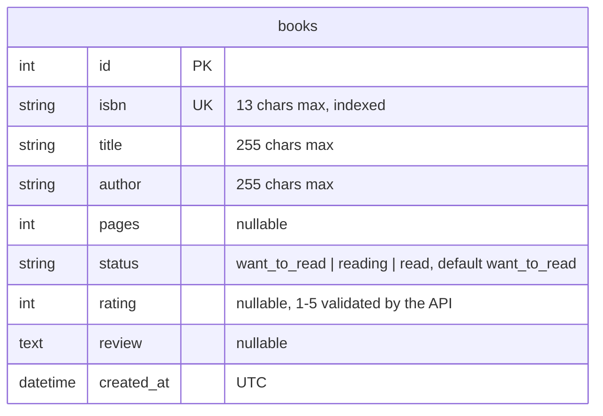

# Entity-relationship diagram

Stage 1: a single `books` table. `Book` is a shared catalog entry (ADR 0002); `status`, `rating` and `review` move to per-user tables in stage 3.

```mermaid
erDiagram
    books {
        int id PK
        string isbn UK "13 chars max, indexed"
        string title "255 chars max"
        string author "255 chars max"
        int pages "nullable"
        string status "want_to_read | reading | read, default want_to_read"
        int rating "nullable, 1-5 validated by the API"
        text review "nullable"
        datetime created_at "UTC"
    }
```
